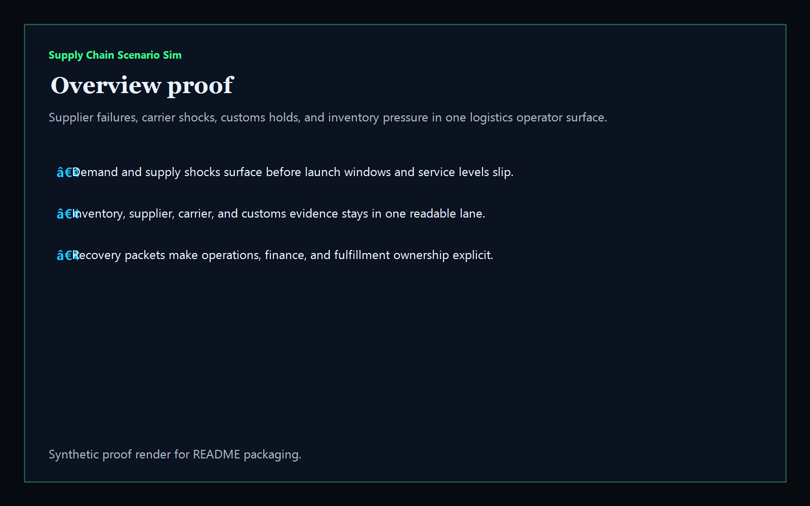
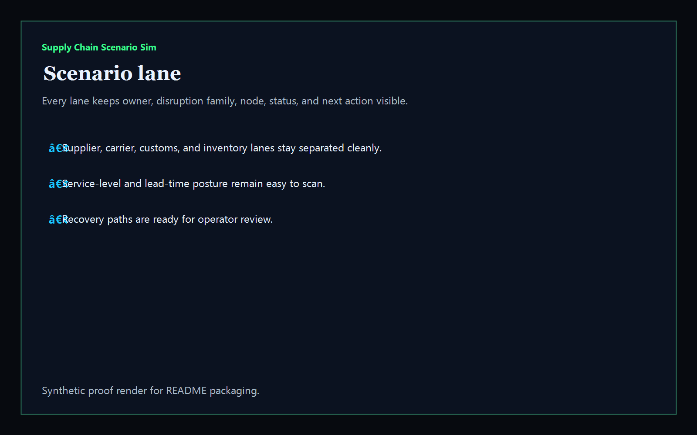
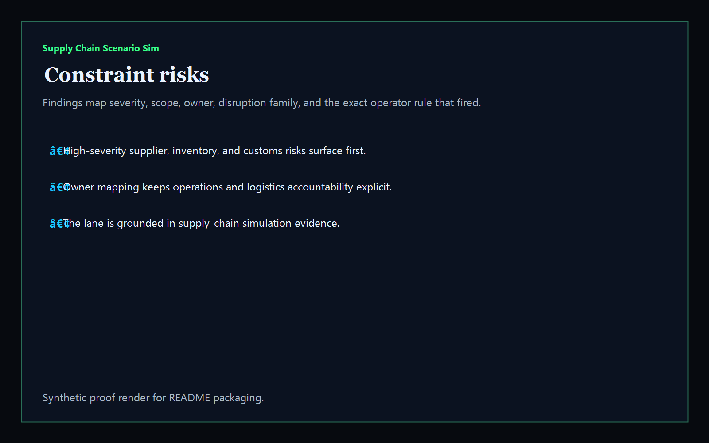
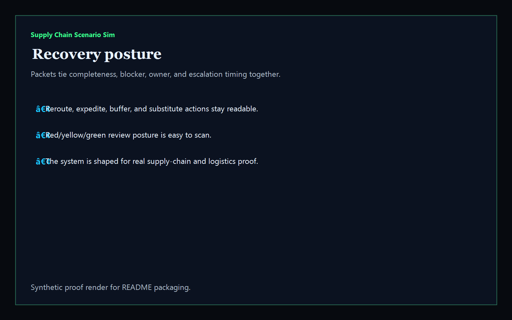

# supply-chain-scenario-sim

[](https://github.com/mizcausevic-dev/supply-chain-scenario-sim/actions/workflows/ci.yml)
[](./LICENSE)
[](https://github.com/mizcausevic-dev/supply-chain-scenario-sim/actions/workflows/pages.yml)

Operator control plane for supply-chain scenario simulation, logistics recovery posture, supplier continuity risk, customs blockers, inventory pressure, and service-level recovery sequencing.

## Why this exists

- Supply teams get buried in spreadsheets, portal tabs, and exception emails when disruption packets should be visible in one operator-readable lane.
- Fulfillment, sourcing, transportation, and finance teams need the same scenario view before launches, replenishment waves, or customer commitments drift.
- Recruiters looking for `supply chain / logistics / operations / scenario simulation / control tower` proof should see a real operator dashboard, not a keyword page.
- This repo turns disruption data into a control plane for supplier risk, carrier congestion, customs holds, inventory buffer pressure, and recovery posture.

## Why this matters (KG Embedded tie-back)

This repo demonstrates the supply-chain-and-recovery control-plane primitive for operations software: disruption packets, service-level risk, recovery sequencing, and evidence-rich operator routing in one surface. Kinetic Gain Embedded extends this pattern into productized in-app dashboards where operations, fulfillment, and finance teams need scenario visibility without exposing raw ERP, TMS, or warehouse consoles. See [kineticgain.com/embedded](https://kineticgain.com/embedded).

## What it shows

- `scenario-lane` visibility for supplier, carrier, customs, inventory, and demand posture in one dashboard
- `constraint-risks` detection for stale baselines, inventory breaches, supplier continuity threats, customs holds, service-level slips, and stale scenario windows
- recovery packets for substitute sourcing, reroutes, customs release, and inventory rebalance sequencing
- offline-safe analysis of captured supply baseline and disruption exports
- recruiter-facing supply-chain / logistics / operations proof that complements the Atlas control-room portfolio

## Routes

- `/`
- `/scenario-lane`
- `/constraint-risks`
- `/recovery-posture`
- `/verification`
- `/docs`

## API

- `/api/dashboard/summary`
- `/api/scenario-lane`
- `/api/constraint-risks`
- `/api/recovery-posture`
- `/api/verification`
- `/api/sample`

## Screenshots






## CLI

```powershell
npx supply-chain-scenario-sim fixtures/supply-scenarios.json `
    --format json|markdown|summary `
    --now 2026-05-30T00:00:00Z `
    --stale-routing-after-hours 24 `
    --fail-on-high `
    --out report.md
```

Input shape:

```json
{
  "baselines": [ ... ],
  "scenarios": [ ... ]
}
```

## Local Development

```powershell
cd supply-chain-scenario-sim
npm install
npm run dev
```

Open:
- [http://127.0.0.1:5517/](http://127.0.0.1:5517/)
- [http://127.0.0.1:5517/scenario-lane](http://127.0.0.1:5517/scenario-lane)
- [http://127.0.0.1:5517/constraint-risks](http://127.0.0.1:5517/constraint-risks)
- [http://127.0.0.1:5517/recovery-posture](http://127.0.0.1:5517/recovery-posture)
- [http://127.0.0.1:5517/verification](http://127.0.0.1:5517/verification)

## Validation

- `npm run lint`
- `npm run typecheck`
- `npm run coverage`
- `npm run build`
- `npm run demo`
- `npm run smoke`
- `npm run prerender`
- `npm run render:assets`

## Production status

| Aspect | Status |
|--------|--------|
| CI | Node 20 + 22 matrix — lint · typecheck · coverage · build · demo · smoke · prerender · `npm audit` |
| License | [AGPL-3.0-or-later](./LICENSE) |
| Deploy | Static prerender -> **https://supply.kineticgain.com/** |
| Data posture | Synthetic sample data only; no live ERP, WMS, TMS, supplier credentials, customs credentials, or production shipment records |

## Docs

- [Kinetic Gain Embedded tie-back](./docs/KINETIC_GAIN_EMBEDDED.md)
- [Changelog](./CHANGELOG.md)

## Composes with

- [**`shipment-exception-command-center`**](https://github.com/mizcausevic-dev/shipment-exception-command-center) — shipment escalation visibility
- [**`dispatch-reliability-control-room`**](https://github.com/mizcausevic-dev/dispatch-reliability-control-room) — dispatch recovery posture
- [**`field-audit-mobile`**](https://github.com/mizcausevic-dev/field-audit-mobile) — mobile capture workflows
- [**`store-ops-incident-board`**](https://github.com/mizcausevic-dev/store-ops-incident-board) — downstream store-side incident handling

Together they form a broader operator lane: logistics disruption handling, supply recovery sequencing, field capture, and fulfillment execution proof.
